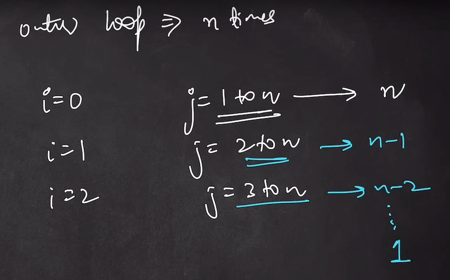
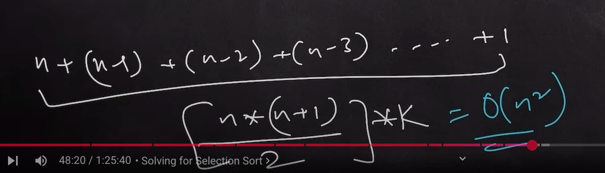

# Time Complexity for Selection Sort
```c++
for(int i = 0; i <n-1; i++){
    int minIdx = i;
    for(int j = j+1; j <n; j++){
        if(arr[j] < arr[minIdx]){
            minIdx = j;
        }
    }
    swap(arr[i], arr[minIdx])
}
```

