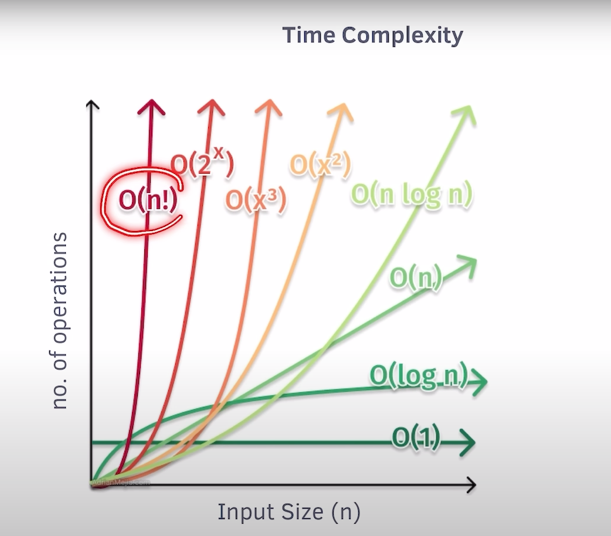

# How to calculate time complexity

**Asymptotic notations:**
- Omega notation() - Best case
- Theta notation() - Average case
- Big O notation(O) - Worst case

## Rules to calculate complexity
1. Always take the Worst case
   ```c++
   for(int i = 0; i < n; i++){
    cout << "Hello World";
   }
   ```
   > Here loop will run times. So worst case is n, so time complexity is O(n)<br>

2. Ignore the constant
   ```c++
   for(int i = 0; i < n-1; i++){
    cout << "Hello World";
   }
   ```
   > Here from n-1 the constant part -1 wil be ignored<br>

