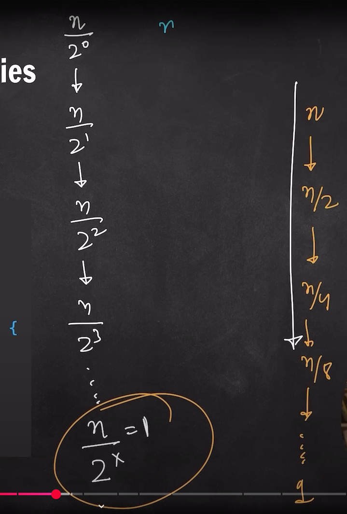
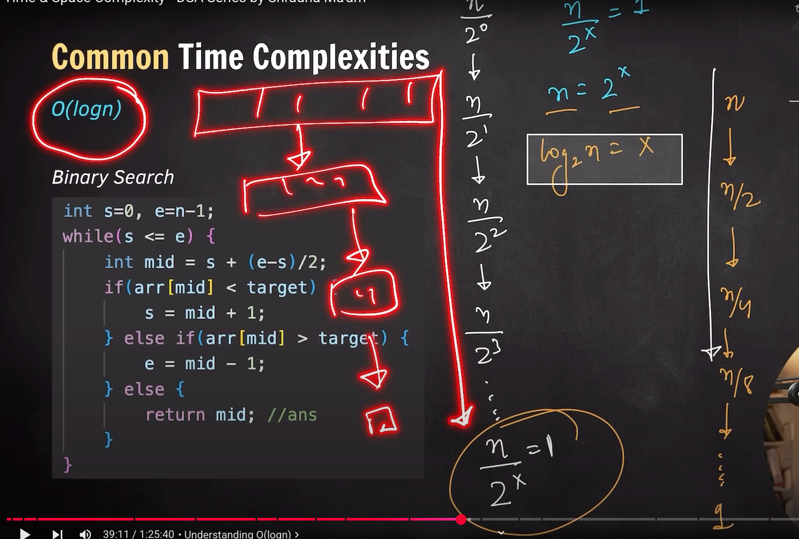

# Logarithmic Complexity O(logN)

```c++
#include<bits/stdc++.h>
using namespace std;
int main()
{
    int n; //? O(1)
    cin >> n; //? O(1)

    for(int i = 1; i < n; i++){ //? O(n)
        cout << endl;
    }
    return 0;
}
```

-------------------------------------------------------------------------------------------------------------------------------------------

```c++
#include<bits/stdc++.h>
using namespace std;
int main()
{
    int n; //? O(1)
    cin >> n; //? O(1)

    for(int i = 1; i < 2*n; i++){ //? O(n)
        cout << endl;
    }
    return 0;
}
```

----------------------------------------------------------------------------------------------------------------------------------------------

```c++
#include<bits/stdc++.h>
using namespace std;
int main()
{
    int n; //? O(1)
    cin >> n; //? O(1)

    for(int i = 1; i < n/2; i++){ //? O(n)
        cout << endl;
    }
    return 0;
}
```

----------------------------------------------------------------------------------------------------------------------------------------------

```c++
#include<bits/stdc++.h>
using namespace std;
int main()
{
    int n; //? O(1)
    cin >> n; //? O(1)

    for(int i = 1; i < n; i+=2){ //? O(n)
        cout << endl;
    }
    return 0;
}
```

----------------------------------------------------------------------------------------------------------------------------------------

```c++
#include<bits/stdc++.h>
using namespace std;
int main()
{
    int n; //? O(1)
    cin >> n; //? O(1)

    for(int i = 1; i < n; i*=2){ //? O(logN)
        cout << endl;
    }
    return 0;
}
```
**Here i will increase like: 1(2^0), 2(2^1), 4(2^2), 8{2^3}, 16(2^4), 32(2^5),-----2^k. So value will be very low. Difference of Number of operations(k) will be high, thats why Complexity will not O(n)**

if 2^k = 1000(n)
log2^2^k = log2^1000
klog2^2 = log^1000
klog = log2^1000
k = log2^1000
operations = log2^n; Here k = operations and n = input
operations = logn ; We know that constant will be deleted, here 2 will be deleted as it is constant

**So if input increase by multiplication or decrease by division then Complexity will be O(logN)**

-------------------------------------------------------------------------------------------------------------------------------------

```c++
for(int i = 0; i >=1; i/=3){ //? O(logN)
    cout << i << endl;
}
```

-------------------------------------------------------------------------------------------------------------------------------------------

```c++
#include<bits/stdc++.h>
using namespace std;
int main()
{
    int n; //? O(1)
    cin >> n; //? O(1)

    int k = 2;

    for(int i = 1; i < n; i++){ //? O(logN) --- accurate answer id O(log2^N) because k is 2, if k is not given then value will be O(logk^N)
        cout << endl;
        i = i * k; //? Check here
    }
    return 0;
}
```

--------------------------------------------------------------------------------------------------------------------------------------------

**Binary Search**
```c++
int s=0, e = n-1;
while(s <= e){
    int mid = (s+e)/2;
    if(arr[mid] < target){
        s = mid + 1;
    }else if(arr[mid] > target){
        e = mid - 1;
    }else{
        return mid;
    }
}
```

