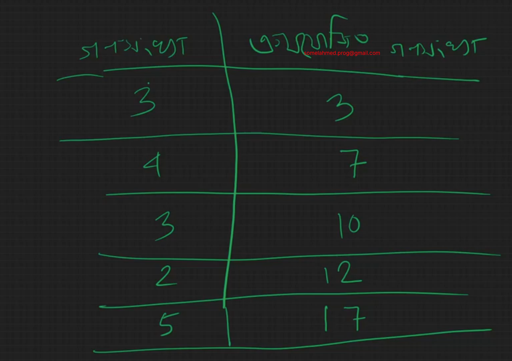
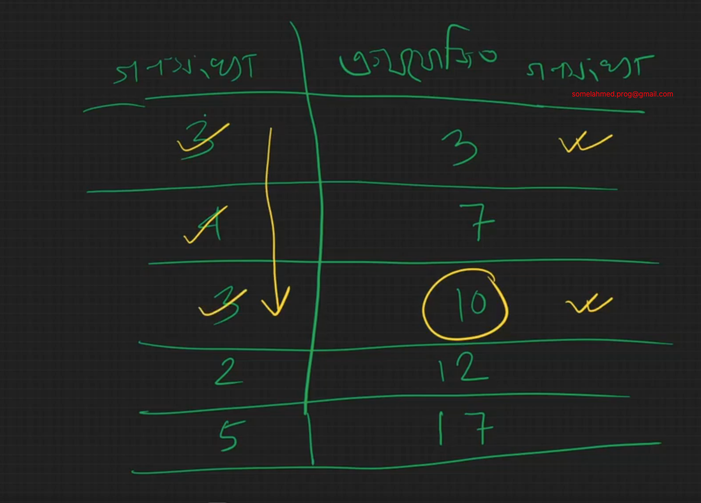
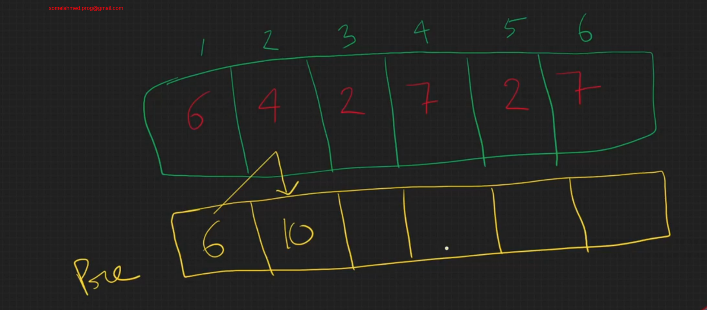
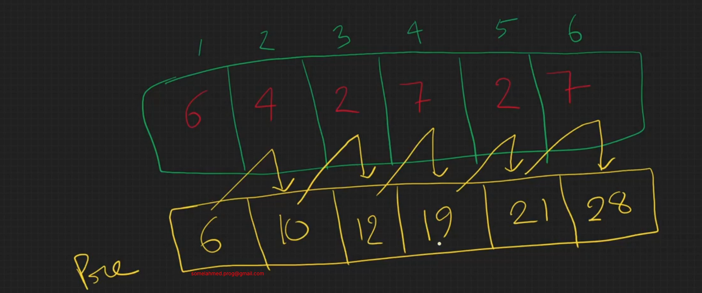
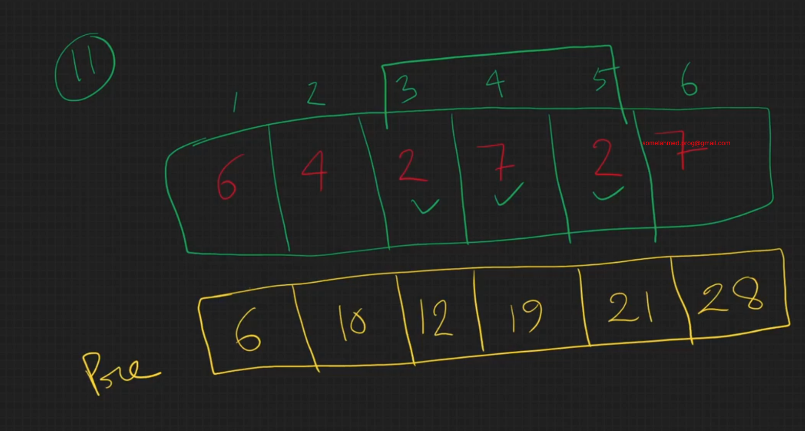
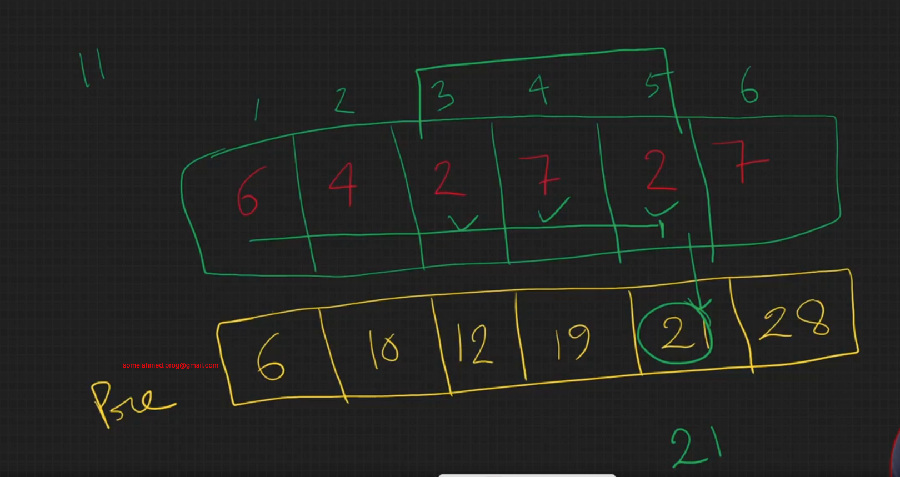
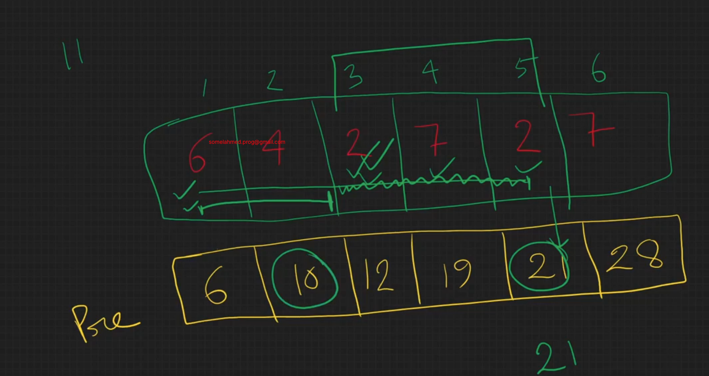
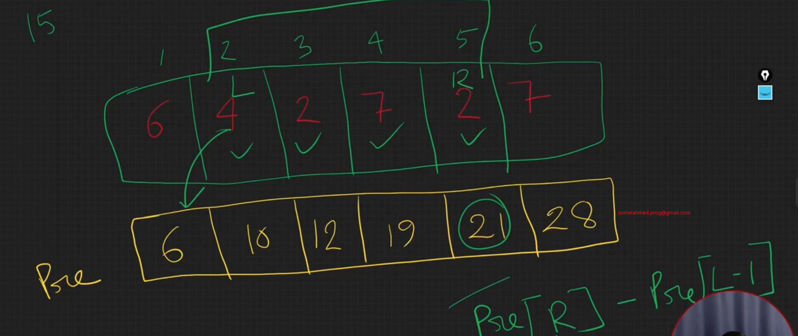

# Range sum Query prefix sum solution

# Idea of Prefix Sum

```c++
#include<bits/stdc++.h>
using namespace std;
int main()
{
    int n, q;
    cin >> n >> q;

    vector<int> v(n+1);

    for(int i = 1; i <= n; i++){ //? O(N) //it can not be ignored, must have
        cin >> v[i];
    }

    while(q--){ //? O(Q)*O(N) = O(QN) //it can not be ignored, must have
        int l, r;
        cin >> l >> r;

        int sum = 0;

        for(int i = l; i <= r; i++){ //? O(N) //to optimize we have to change it using prefix sum
            sum += v[i];
        }

        cout << sum << endl;
    }

    return 0;
}

//! Time Complexity of this code is = O(QN) = 10^5*10^5 = 10^10. but program can run only 10^7 operations in 1s.
```

## Prefix Sum:







**21-10 = 11**

**Corner Case if l = 1**: So Pre[l-1] = Pre[0] but it is 1-indexed.
So, if l = starting Index, then formula: Pre[r]; else formula: Pre[r]-Pre[l-1]

```c++
#include<bits/stdc++.h>
using namespace std;
int main()
{
    int n, q;
    cin >> n >> q;

    vector<long long int> v(n+1);

    for(int i = 1; i <= n; i++){ //? O(N)
        cin >> v[i];
    }

    vector<long long int> pre(n+1);
    pre[1] = v[1];
    for(int i = 2; i <= n; i++){ //? O(N)
        pre[i] = pre[i-1]+v[i];
    }

    while(q--){ //? O(Q)
        int l, r;
        cin >> l >> r;

        if(l==1){
            cout << pre[r] << endl;
        }else{
            cout << pre[r] - pre[l-1] << endl;
        }
    }

    return 0;
}
//! Time Complexity of this code is = O(N)+O(N)+O(Q) = O(N); Here N and Q have same value  
```

