# Time Complexity for Recursion

```c++
int factorial(int n){
    if(n == 0){
        return 1l
    }
    return n * factorial(n-1);
}
```
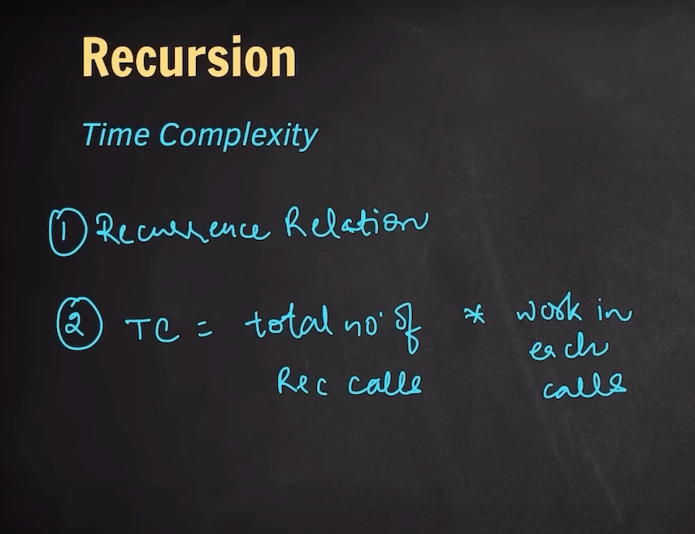
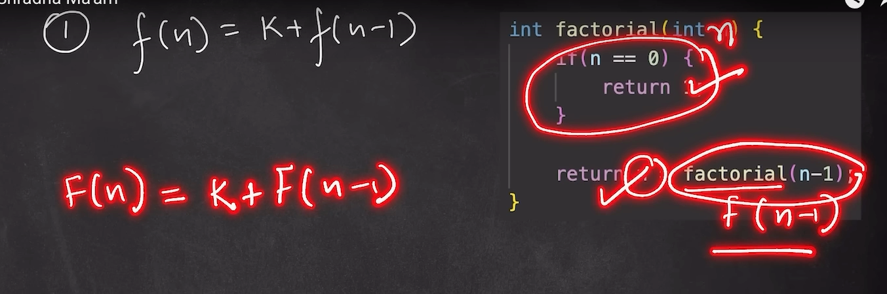
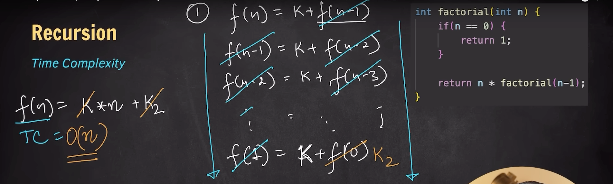
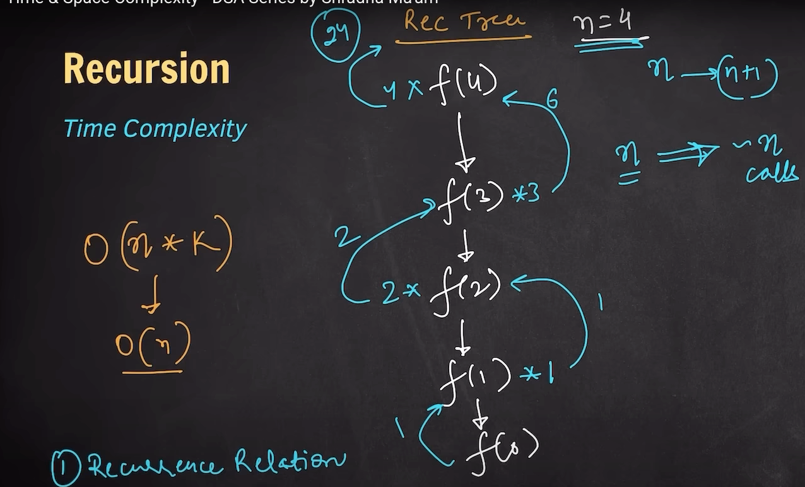

# Space Complexity for Recursion
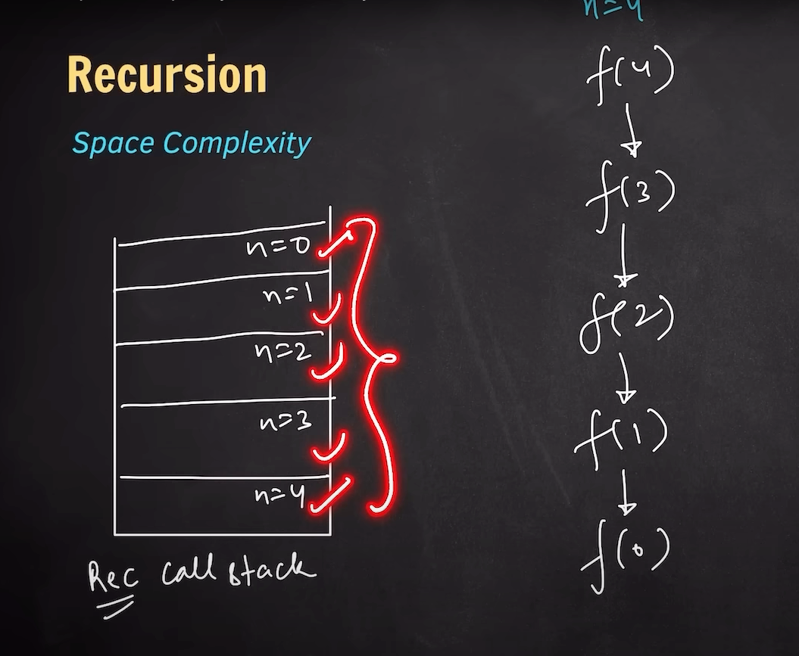
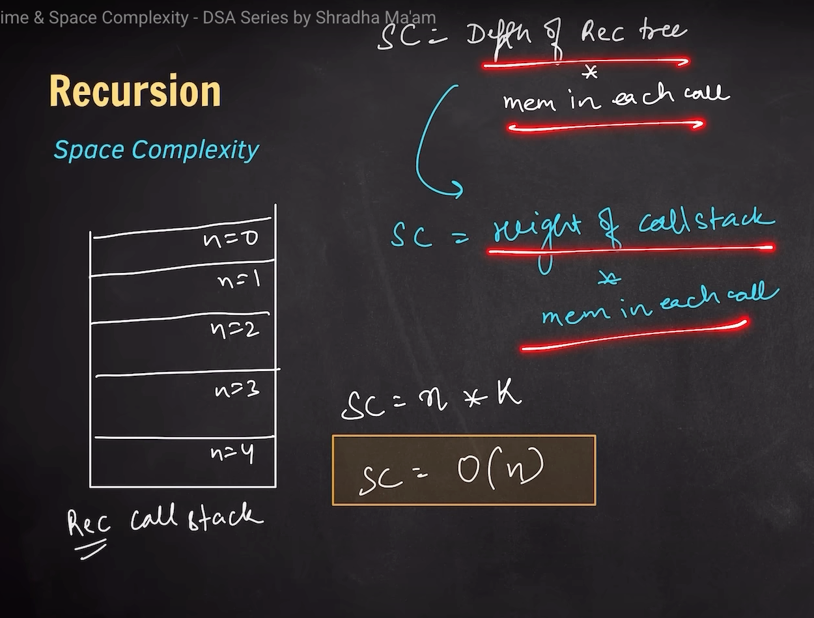

----------------------------------------------------------------------------------------------------------------------------------------

**Recursive Fibonacci**
## Time Complexity
```c++
int fib(int n){
    if(n == 0 || n == 1){
        return n;
    }

    return fib(n-1) + fib(n-2);
}
```
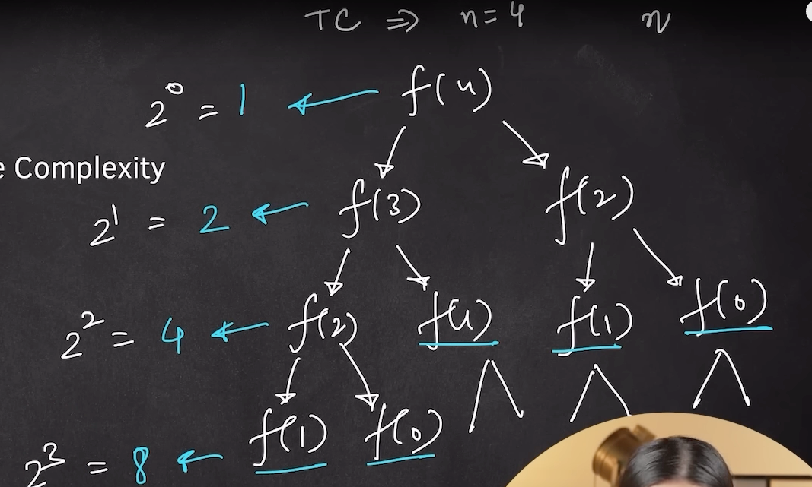
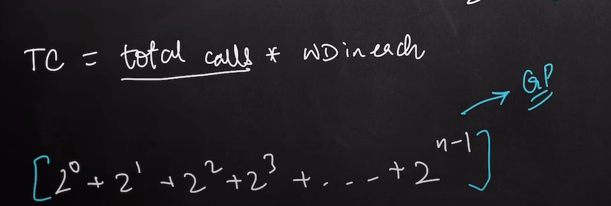
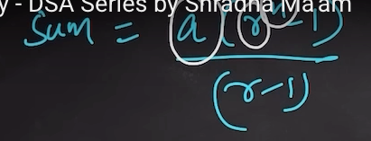

Here, a = first value; r = common difference; 

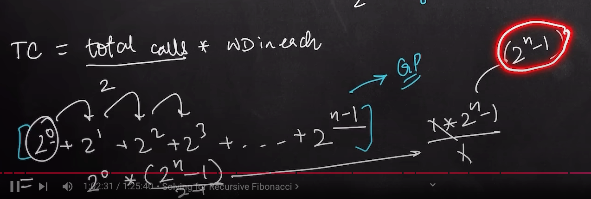

## Space Complexity
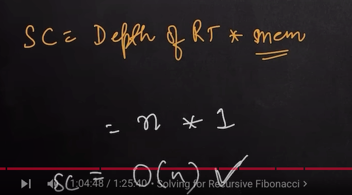

