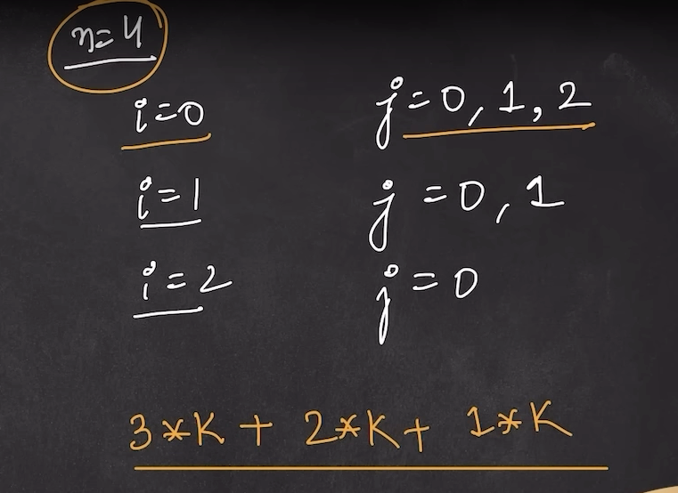
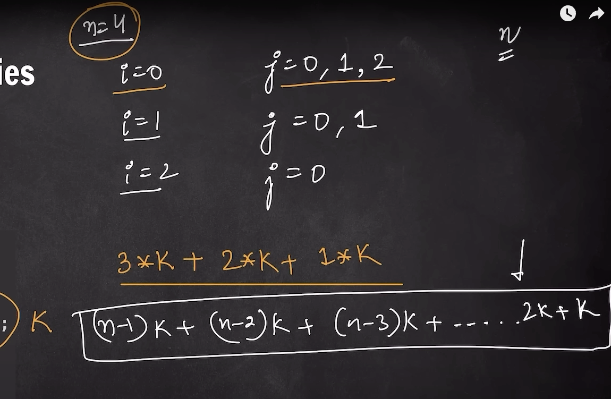
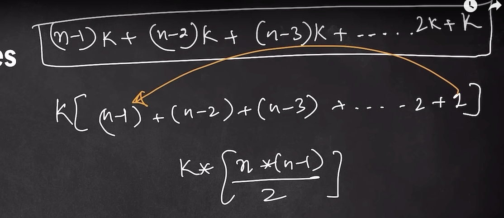
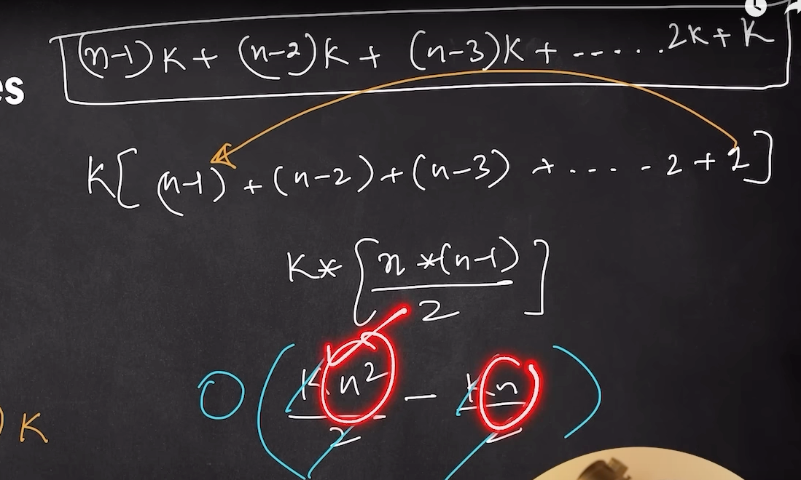
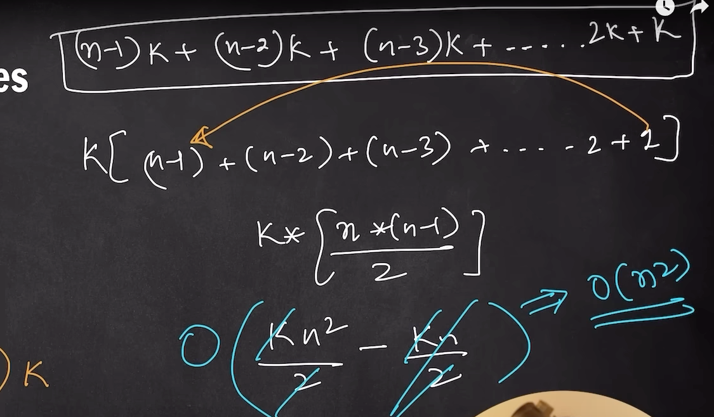

# Quadratic complexity O(N_N)

```c++
#include<bits/stdc++.h>
using namespace std;
int main()
{

    int n;
    cin >> n;

    for(int i = 0; i < n; i++){ //? O(N)
        cout << "Hello World" << endl;
    }
    return 0;
}
```

------------------------------------------------------------------------------------------------------------------------------------------------

```c++
#include<bits/stdc++.h>
using namespace std;
int main()
{

    int n;
    cin >> n;

    for(int i = 0; i < n; i++){ //? O(N)
        for(int j = 0; j < n; j++){ //? O(N)
            cout << "Hello World" << endl;
        }
    }
    return 0;
}
```
**Time complexity of the above code is **O(N*N) or O(N^2) because there is nested loop****

---------------------------------------------------------------------------------------------------------------------------------------

```c++
#include<bits/stdc++.h>
using namespace std;
int main()
{

    int n;
    cin >> n;

    for(int i = 0; i < n; i++){ //? O(N)
        cout << "Hello World" << endl;
    }
    for(int j = 0; j < n; j++){ //? O(N)
            cout << "Hello World" << endl;
    }
    return 0;
}
```
**Time complexity of the above code is **O(N+N) = O(2N) = O(N)** as constant will not be considered and loops are not nested**

-----------------------------------------------------------------------------------------------------------------------------------------

```c++
#include<bits/stdc++.h>
using namespace std;
int main()
{

    int n, m;
    cin >> n >> m;

    for(int i = 0; i < n; i++){ //? O(N)
        for(int j = 0; j < m; j++){ //? O(M)
            cout << "Hello World" << endl;
        }
    }
    return 0;
}
```
**Time complexity of the above code is **O(N*M)** as loops are nested**

-------------------------------------------------------------------------------------------------------------------------------------------------

```c++
#include<bits/stdc++.h>
using namespace std;
int main()
{

    int n, m;
    cin >> n >> m;

    for(int i = 0; i < n; i++){ //? O(N)
        for(int j = 0; j < n; j++){ //? O(N)
            for(int k = 0; k < n; k++){ //? O(N)
                cout << "Hello World" << endl;
            }
        }
    }
    return 0;
}
```
**Time complexity of the above code is **O(N*N*N) = O(N^3)** as loops are nested**

------------------------------------------------------------------------------------------------------------------------------------------

**Bubble Sort**
```c++
for(int i = 0; i < n-1; i++){ //? N
    for(int j = 0; j <n-i-1; j++){
        if(arr[j] > arr[j+1]){ //? 
            swap(arr[j], arr[j+1])
        }
    }
}
```




