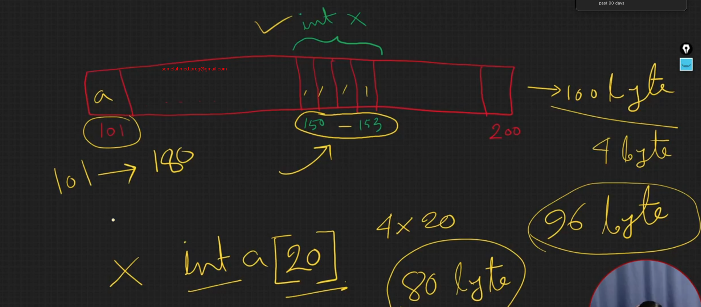

# Another Limitation of Array
- Fixed Size (It can be fixed using Vector)
- Sequential Memory Allocation

```c++
#include<bits/stdc++.h>
using namespace std;
int main()
{
    int a[5] = {1, 2, 3, 4, 5};
    cout << (long long)&a[2] << " " << (long long)&a[3]; //? 140725992895688 140725992895692
    return 0;
}
```

------------------------------------------------------------------------------------------------------------------------------------------

```c++
#include<bits/stdc++.h>
using namespace std;
int main()
{
    vector<int> v = {1, 2, 3, 4, 5};
    cout << (long long)&v[2] << " " << (long long)&v[3]; //? 94401218974392 94401218974396
    return 0;
}
```

---------------------------------------------------------------------------------------------------------------------------------------

```c++
#include<bits/stdc++.h>
using namespace std;
int main()
{
    vector<int> v = {1, 2, 3, 4, 5};
    v.push_back(100);
    cout << (long long)&v[4] << " " << (long long)&v[5]; //? 94863859024608 94863859024612
    return 0;
}
```

---------------------------------------------------------------------------------------------------------------------------------------------


