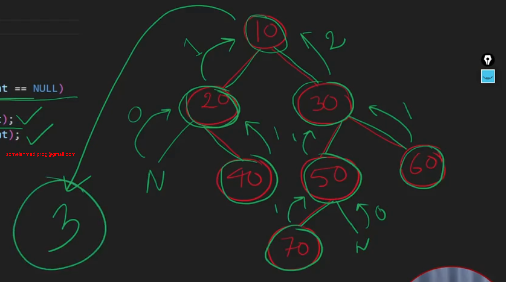

# Count leaf nodes in a binary tree

```c++
#include<bits/stdc++.h>
using namespace std;

class Node {
    public:
    int val;
    Node* left;
    Node* right;
    Node(int val) {
        this->val = val;
        this->left = NULL;
        this->right =NULL;
    }
};

Node* inputTree(){
    int val;
    cin >> val;
    Node* root;
    if(val == -1) root = NULL;
    else root = new Node(val);
    queue<Node*> q;
    if(root) q.push(root);
    while(!q.empty()){
        //? 1. ber kore ana
        Node* p = q.front();
        q.pop();
        //? 2. oi node niea kaj
        int l, r;
        cin >> l >> r;
        Node* myLeft, *myRight;
        if(l == -1) myLeft = NULL;
        else myLeft = new Node(l);
        if(r == -1) myRight = NULL;
        else myRight = new Node(r);
        p->left = myLeft;
        p->right = myRight;
        //? 3. children push kora
        if(p->left)
            q.push(p->left);
        if(p->right)
            q.push(p->right);
    }
    return root;
}

int countLeafNodes(Node* root){
    if(root == NULL){
        return 0;
    }
    if(root->left == NULL && root->right == NULL) return 1;
    int l = countLeafNodes(root->left);
    int r = countLeafNodes(root->right);

    return l+r;
}

int main()
{
    Node* root = inputTree();
    cout << countLeafNodes(root) << endl;
    return 0;
}
```
```bash
//input
10 20 30 -1 40 50 60 -1 -1 70 -1 -1 -1 -1 -1
//output
3
```