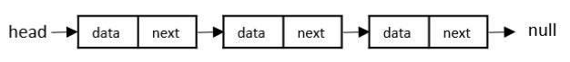

# Creating A Node



```c++
#include<bits/stdc++.h>
using namespace std;

class Node{
    public:
    int val;
    Node* next;
};

int main()
{
    Node a, b, c;
    a.val = 10;
    b.val = 20;
    c.val = 30;

    a.next = &a;
    b.next = &c;
    c.next = NULL;

    cout << a.val << " " << b.val << " " << c.val << endl;
    cout << a.next << " " << b.next << " " << c.next << endl;
    return 0;
}
```
```bash
10 20 30
0x7fff2b43a6d0 0x7fff2b43a6f0 0
```

------------------------------------------------------------------------------------------------------------------------------------------

```c++
#include<bits/stdc++.h>
using namespace std;

class Node{
    public:
    int val;
    Node* next;
};

int main()
{
    Node a, b, c;
    a.val = 10;
    b.val = 20;
    c.val = 30;

    a.next = &b;
    b.next = &c;
    c.next = NULL;

    cout << a.val << endl; //? 10
    cout << a.next << endl; //? 0x7ffc374309c0
    return 0;
}
```

--------------------------------------------------------------------------------------------------------------------------------------------

```c++
#include<bits/stdc++.h>
using namespace std;

class Node{
    public:
    int val;
    Node* next;
};

int main()
{
    Node a, b, c;
    a.val = 10;
    b.val = 20;
    c.val = 30;

    a.next = &b;
    b.next = &c;
    c.next = NULL;

    cout << a.val << endl; //? 10
    cout << (*a.next).val << endl; //? 20
    return 0;
}
```

-------------------------------------------------------------------------------------------------------------------------------------

```c++
#include<bits/stdc++.h>
using namespace std;

class Node{
    public:
    int val;
    Node* next;
};

int main()
{
    Node a, b, c;
    a.val = 10;
    b.val = 20;
    c.val = 30;

    a.next = &b;
    b.next = &c;
    c.next = NULL;

    cout << a.val << endl;
    cout << *(a.next).val << endl;
    return 0;
}


//! difference between: cout << (*a.next).val<< endl;
```
### The Key Difference
(*a.next).val ✅ CORRECT
*(a.next).val ❌ INCORRECT

### Why the Difference Matters
Operator Precedence:
- The dot operator . has higher precedence than the dereference operator *
- Parentheses () have the highest precedence

### Let's Break Down Each Expression
1. **(*a.next).val** - **CORRECT**
```cpp
Step 1: a.next        // Get the pointer (points to node b)
Step 2: *a.next       // Dereference the pointer (gets node b object)  
Step 3: (*a.next).val // Access val member of node b object
```

2. ***(a.next).val** - **INCORRECT**
```cpp
Step 1: a.next        // Get the pointer (points to node b)
Step 2: (a.next).val  // Try to access .val on a POINTER (ERROR!)
Step 3: *((a.next).val) // Try to dereference the result (ERROR!)
```

-------------------------------------------------------------------------------------------------------------------------------------

```c++
#include<bits/stdc++.h>
using namespace std;

class Node{
    public:
    int val;
    Node* next;
};

int main()
{
    Node a, b, c;
    a.val = 10;
    b.val = 20;
    c.val = 30;

    a.next = &b;
    b.next = &c;
    c.next = NULL;

    cout << a.val << endl; //?10
    cout << a.next ->val << endl; //? 20
    return 0;
}
```

------------------------------------------------------------------------------------------------------------------------------------------------

```c++
#include<bits/stdc++.h>
using namespace std;

class Node{
    public:
    int val;
    Node* next;
};

int main()
{
    Node a, b, c;
    a.val = 10;
    b.val = 20;
    c.val = 30;

    a.next = &b;
    b.next = &c;
    c.next = NULL;

    cout << a.val << endl; //? 10
    cout << (*(*a.next).next).val << endl; //? 30
    return 0;
}
```

--------------------------------------------------------------------------------------------------------------------------------------------

```c++
#include<bits/stdc++.h>
using namespace std;

class Node{
    public:
    int val;
    Node* next;
};

int main()
{
    Node a, b, c;
    a.val = 10;
    b.val = 20;
    c.val = 30;

    a.next = &b;
    b.next = &c;
    c.next = NULL;

    cout << a.val << endl; //? 10
    cout << a.next->next->val << endl; //? 30
    return 0;
}
```