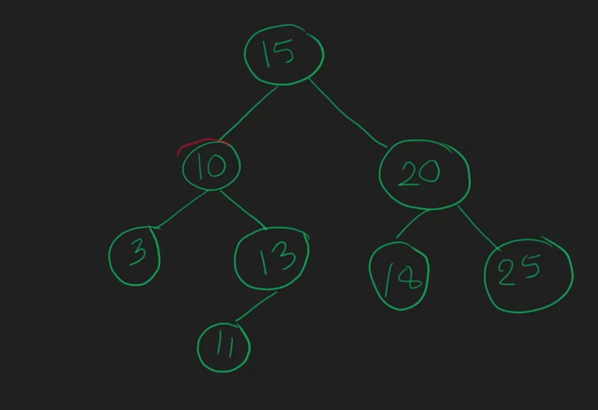
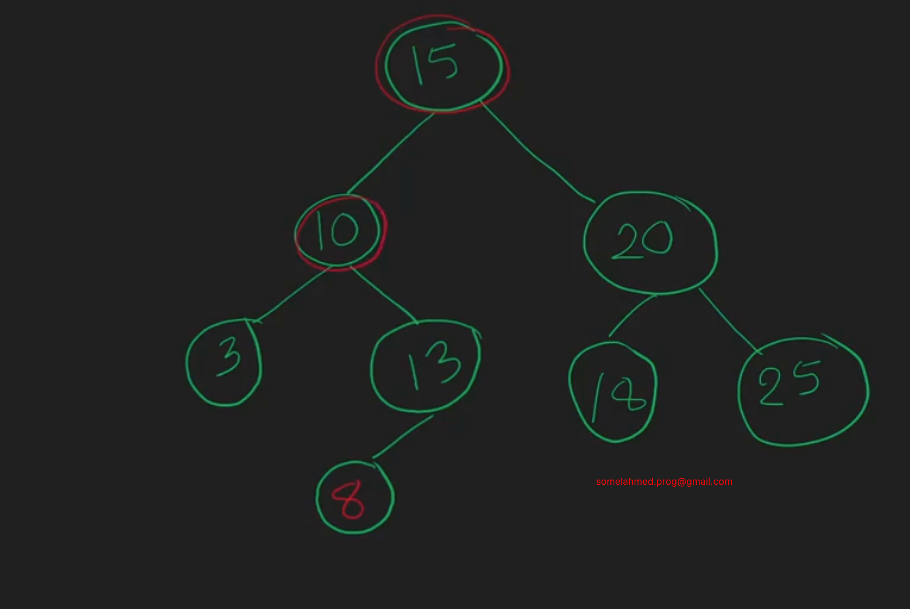

# What is BST
**Binary Search Tree** --> Binary Search + Binary Tree
A **Binary Search Tree** is a special type of binary tree where:

1. **Each node** has at most two children (left and right).
2. For **any node**:
- **All values** in the **left subtree** are **less than** the node’s value.
- **All values** in the **right subtree** are **greater than** the node’s value.
## BST

## NOT BST

**In simple terms:**
A **BST** is a binary tree that keeps data in sorted order, so you can quickly search for, add, or remove values.