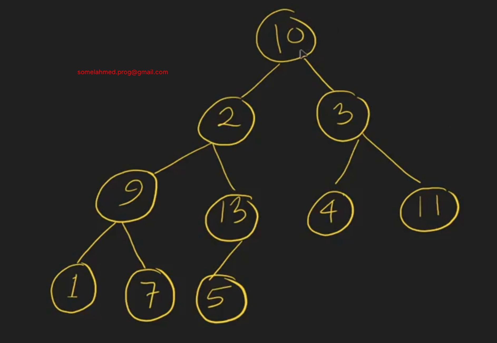

# Array representation of complete binary tree

## Parent to Child
**---------------------------------**
parentIndex*2+1 = LeftChildIndex;
parentIndex*2+2 = RightChildIndex;
**---------------------------------**

## Child to Parent
**--------------------------------**
(ChildIndex-1)/2 = parentIndex;
**--------------------------------**