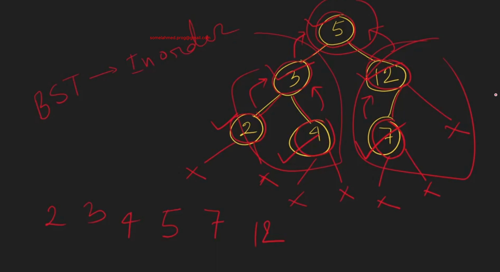

# 23_8 What is set --> it is STL for BST
- Does not contain duplicate values. Only contain unique values.
- store values in sorted. 
  if we do inorder travesal on BST, then we get sorted values.
  
